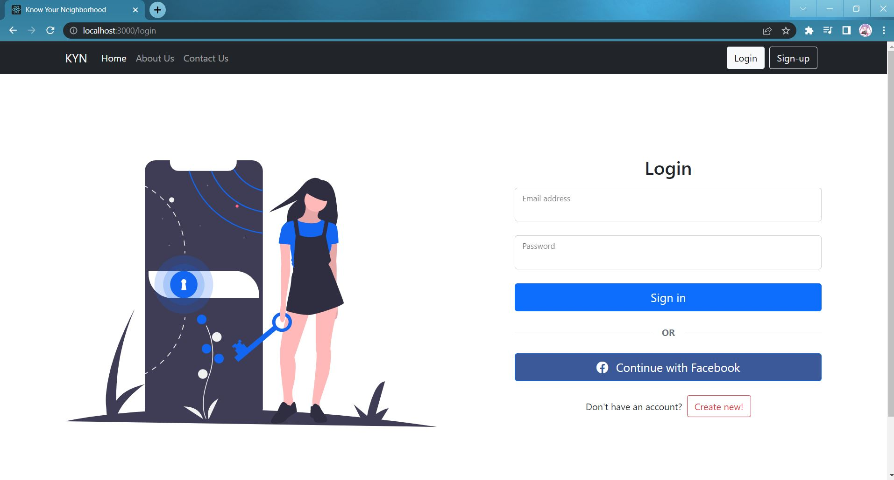
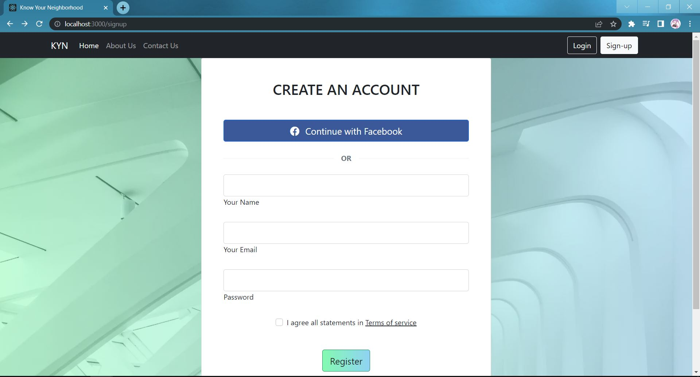
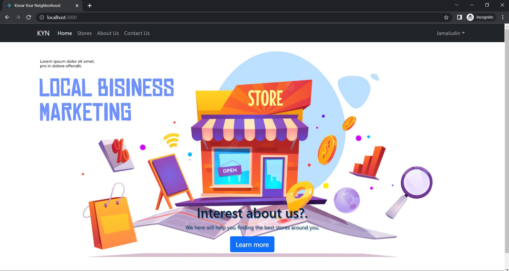
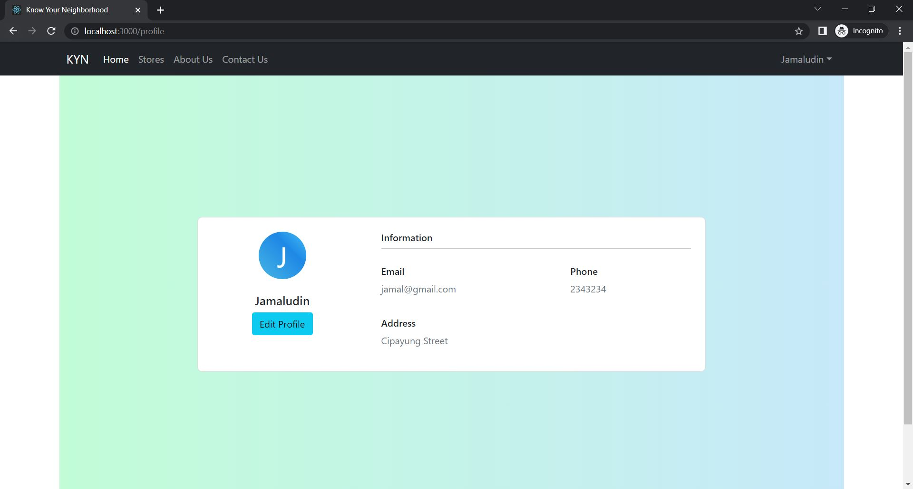
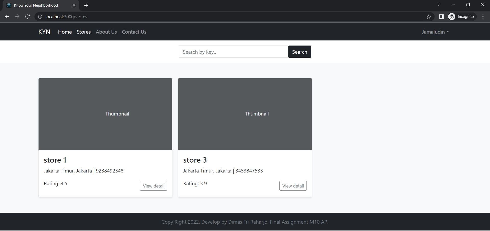
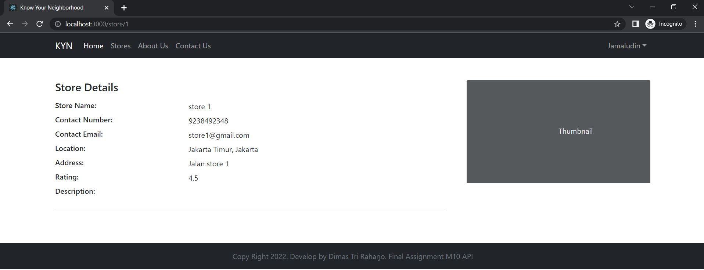

# KYN-API-with-SpringBoot-React
BRIEF DESCRIPTION   
RESTful API and Website for Know Your Neighborhood Stores. A simple webapp for user to know stores around their neighborhood.

PATCH
- Some bugs on the Frontend (React)
  - History -> Directing -> Routing
- Not all page got implemented in the frontend
- All API in the backend has been tested in Postman and passed

OVERVIEW    
The Know-Your-Neighborhood website consist of the following key pages
-	Home page
-	Registration page
-	Login page with API link (Facebook OAuth2)
-	Contact Us page
-	About Us page
-	Terms and Condition page

User will be able to login using existing API by providing username or email and password then fetch basic information such as name and email from the API.   
The scope of the Project is to research of different existing APIs and compare for each of your examples and evaluates their suitable while also identifying and potential security issues and build a login with selected API in existing website.

TECHNOLGIES USED & SYSTEM REQUIREMENTS    
Backend: Java SE 1.8, Spring Boot  
Frontend: HTML 5, CSS, Bootstrap 5, React.js    
DBMS: MySQL 8.0.27    
OS: Windows 10    
IDE: STS 4, VSCode    

Note*   
Different version can be use but keep in mind to change the configuration / settings too in related place. Use the Recommend above to avoid unnecessary error.

HOW TO RUN    
Backend
- Have a Java Installed in the computer
- Import maven project the `KYN-final-assignment` folder to the STS. Do maven update!
- Create new database in MySQL with same name mention in the `application.properties` (Could be change to your preference)
- Run as spring boot app

Frontend
- Have a node.js installed in the computer
- Create react project `npx create-react-app kyn-final-api`
- Open the project folder in the VSCode then go inside the folder `cd kyn-final-api`
- Paste replace the `src` and `public` folder
- Install the necessary nodes as mention in the `package.json` or Re-Install to change the version
- Run the project `npm start`

PREVIEW SOME SCREENSHOT

